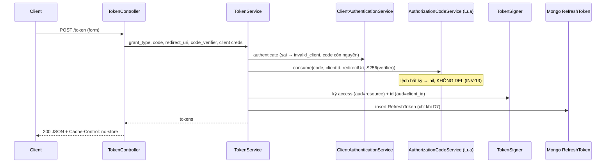

# Tech Lead Review — 2026-10-08 (run 13 — B4.4 `/token` authorization_code)

## Kết luận: PASS

Phạm vi, ranh giới B4.4↔B4.5 và thứ tự 4 task [BE] đúng. Q6 hợp lý cho production. Khi đối chiếu với code, tôi thấy một số gap **nhỏ**: tasks.md lệch với code thật, INV-13 còn thiếu một chỗ, và filter lỗi OAuth không sinh đủ mã. Theo ủy quyền, tôi đã **đưa trực tiếp** các điểm này vào acceptance của tasks.md (đánh dấu *(tech-lead fold)*), nên không cần quay lại analyst.

## Thẩm định Q6 (được ủy quyền — GIỮ NGUYÊN)
- `ACCESS_TOKEN_TTL=900` khớp khuyến nghị spec §8 (15'). Đây cũng là thời gian tối đa một access token còn hiệu lực sau khi revoke (revocation strategy ở spec §8). Đúng.
- `REFRESH_TOKEN_TTL=2592000` (30 ngày, absolute): hợp lý cho `offline_access`. Rủi ro token sống lâu được giảm bằng strict rotation + reuse detection ở B4.5 (INV-10/11). B4.4 chỉ set `expiresAt = issuedAt + TTL`. Đúng.
- ID token TTL = access TTL: OIDC cho phép, và ID token không dùng để gọi API. Không thêm env. Đúng.
- Hai env đã có trong `validation.schema.ts` (`positiveInt`) và `.env.example` (900 / 2592000), nên không phải đổi config.

## Kiến trúc đề xuất
Giữ modular monolith, thêm vào `OauthModule` (không tạo module mới):
- `oauth/token/token.controller.ts` — `POST /token`: parse form, xác định phương thức client auth, đổi lỗi domain sang JSON OAuth + `no-store`.
- `oauth/token/token.service.ts` — điều phối theo thứ tự: client auth (B3.3) → kiểm `grantTypes` → `consume(code, clientId, redirectUri, challenge)` → ký token → insert RefreshToken (D7) → audit.
- Phần dựng claims để ở dạng hàm thuần (test unit được). **Không** thêm abstraction (`TokenFactory`, strategy theo grant…) — B4.5 sẽ thêm nhánh `refresh_token` khi thực sự cần.
- `OauthModule.imports += KeysModule`. Model `RefreshToken` đã đăng ký global (`MongoModule` `@Global` + `forFeature(MODELS)`), không cần đăng ký lại.

## Điểm mạnh
- Ranh giới B4.4↔B4.5 rõ ràng: B4.4 chỉ insert, không rotation/reuse/revoke. Phần atomic khó nhất không bị làm dở dang.
- Dùng lại đúng các primitive đã kiểm chứng: `ClientAuthenticationService` (cân bằng timing, B3.3), `AuthorizationCodeService.consume` (Lua, INV-13 cho client/redirect), `TokenSigner` (RS256 + `kid` + `iss` + `jti`), `deriveS256Challenge`, `generateToken`/`sha256`.
- D7 fail-closed (cần cả grant `refresh_token` VÀ scope `offline_access`). Refresh token chỉ lưu hash. `aud` chỉ lấy từ code đã bind.
- Mỗi task có acceptance đo được và security invariants.

## Vấn đề phát hiện khi đối chiếu code (đã fold vào tasks.md — dev bắt buộc làm)
- [x] **INV-13 chưa đủ**: spec §15 #13 yêu cầu bind cả **PKCE challenge** trước khi xoá code. Lua B4.3 hiện chỉ so `clientId`/`redirectUri`, nên một `code_verifier` sai sẽ **xoá mất code** của chủ hợp lệ. Đã fold: mở rộng `consume(..., codeChallenge)`, Lua so thêm `ARGV[3]`; test gửi verifier sai rồi verifier đúng → 200. (Cách này chặt hơn spec §9.5, vốn verify PKCE sau khi DEL.)
- [x] **Resource vắng**: tasks.md nói sentinel `""`, nhưng trong code thật `resource` là `undefined` (sentinel chỉ có trong `ConsentService.normalizeResource`). Đã fold: kiểm `!data.resource` → `invalid_target`, không ký token, không insert (schema `RefreshToken.resource` là required).
- [x] **Lỗi OAuth**: `OAuthExceptionFilter` global chọn mã lỗi theo HTTP status, nên không thể sinh `invalid_grant`/`unsupported_grant_type`/`invalid_target`/`unauthorized_client`. Đã fold: lỗi domain `TokenError(code, status)` render ở controller hoặc filter cục bộ; `no-store` cả trên response lỗi; thêm `WWW-Authenticate` cho 401 khi client dùng Basic.
- [x] **`ValidationPipe` global có `forbidNonWhitelisted`**, sẽ trả 400 khi có tham số lạ — trái RFC 6749 §3.1. Đã fold: `/token` parse riêng; tham số lặp → `invalid_request`. Parser urlencoded đã có sẵn trong `FastifyAdapter`.
- [x] **Thứ tự client auth**: đã fold test "client auth sai không làm mất code", và kiểm `grantTypes` có `authorization_code` (thiếu → `unauthorized_client`).
- [x] **Nhận diện phương thức client auth**: chốt quy tắc Basic / post / none; cấm dùng >1 phương thức; `client_id` trong body khác Basic → `invalid_client`.
- [x] **`grantTypes` khi đọc `.lean()`**: default của Mongoose không áp cho document cũ khi đọc lean, nên phải chuẩn hoá trong `ClientService`; thêm enum giá trị.
- [x] **ID token chỉ phát khi scope có `openid`** (OIDC Core). **`authTime` là optional (đơn vị ms)**: vắng thì bỏ claim, không tự điền `now`, để step-up B6.2 vẫn fail-closed.
- [x] **Admin resource (D3/D6)**: suy từ `ISSUER` (`new URL('/admin/', issuer)`), đặt ở một chỗ để B6 dùng lại.
- [x] **Failure semantics**: Redis/KeyProvider/Mongo/audit lỗi → 500, không phát hành token dở dang. Hai request song song cùng code → đúng 1 thành công và 1 RefreshToken.
- [x] **Audit INV-25**: ghi `TOKEN_ISSUED`, không chứa giá trị bí mật.
- [x] **CORS**: chốt không wire ở B4.4; DEBT-019/020 dời sang B4.6.

## Gap amr/acr
Hằng số `amr=["pwd"]` / `acr="urn:idp:aal1"` chấp nhận được cho M3, vì login hiện chỉ có password và chưa có MFA. Rủi ro: khi làm B5 (federation), `amr` sẽ sai. Đã ghi **DEBT-030**: mang `amr` từ session → code → token khi làm B5. Không chặn B4.4.

## Security gate (trust boundary `/token`)
- Tài sản/actor/boundary: code, verifier, client secret, access/id/refresh token; client hợp lệ / client khác / attacker giữ code. ✅
- Invariant & state transition: code chỉ bị DEL atomic khi client + redirect + challenge đều khớp; client auth chạy trước consume. ✅
- Abuse cases: replay (single-use + test concurrency); sai client/redirect/verifier không gây DoS (INV-13); enumeration (`invalid_client` đồng nhất); confused deputy (`resource` trong body không đổi được `aud`). ✅
- Failure: Redis/Mongo/KeyProvider/audit lỗi → fail-closed 500, không trả token dở dang. ✅
- Exposure: `no-store`; không log/audit token/code/verifier/secret; lỗi không tiết lộ code có tồn tại hay không. ✅

## Đề xuất (không bắt buộc)
- Rate-limit `/token` theo `client_id` + IP (guard đã có từ B1) — để B7 hardening (**DEBT-029**).
- DEBT-026/027 (consent) thuộc `/authorize`; để ngoài B4.4 cho run gọn. Dời mục tiêu sang B4.6.
- DEBT-025: mở rộng Lua consume (thêm ARGV[3]) không tạo script thứ 3, nên debt giữ nguyên.
